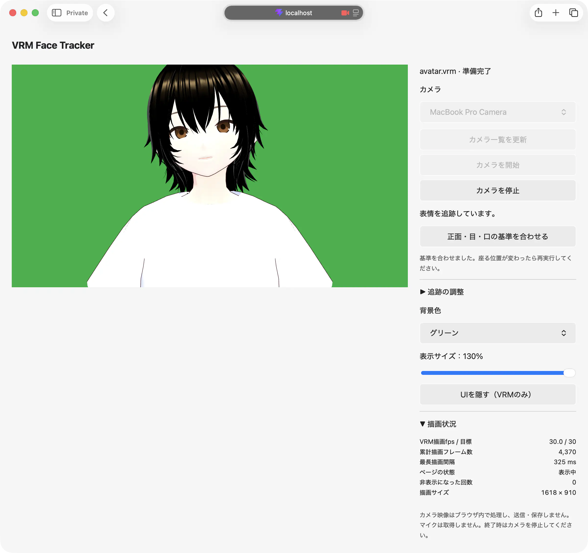
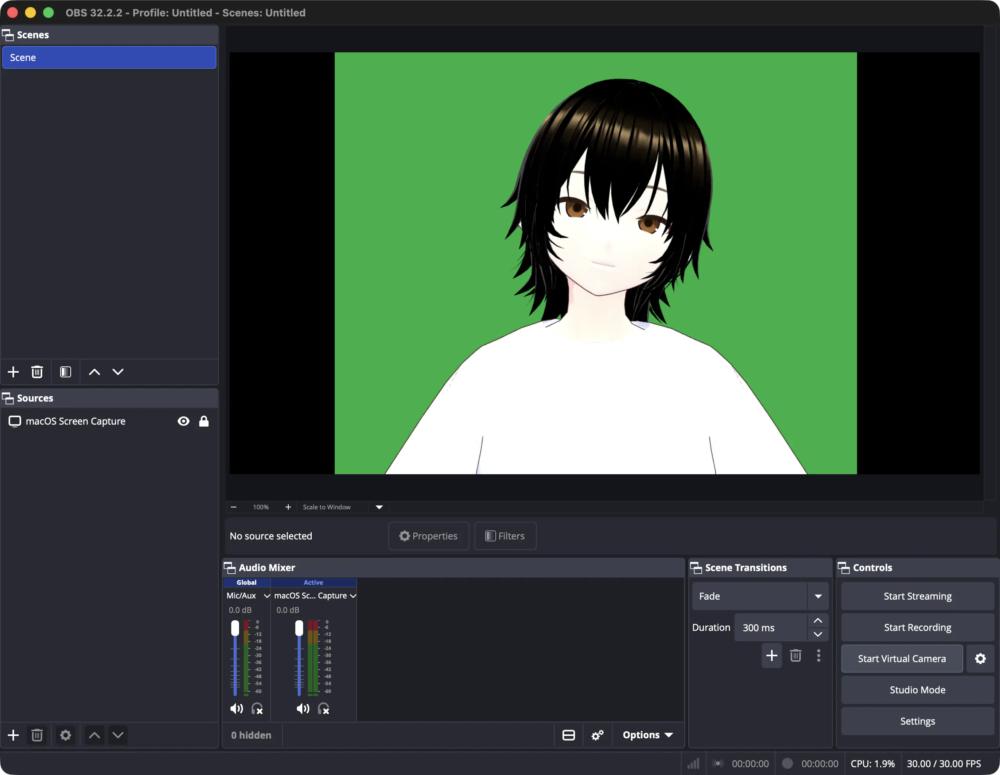

# VRM Face Tracker
  
  

内蔵カメラで顔の向きや表情を検出してVRMアバターへ反映するアプリです  
OBS Virtual Cameraを経由して、ZoomやMicrosoft Teamsのカメラ映像として利用できます

## 動作環境
macOSの最新版Google Chrome（安定版）と、ブラウザ版のZoom・Teamsで基本動作を確認済み

## セットアップ
使用許諾のあるVRMを `public/vrm/models/avatar.vrm` に配置します
```sh
nix develop
pnpm install --frozen-lockfile
pnpm setup:tracking
pnpm dev --host 127.0.0.1
```

`setup:tracking` は学習済みモデルのダウンロードとSHA-256検証、WASMの配置を行います。通常は初回のみ必要で、既存モデルは再ダウンロードしません  
ファイルは `public/tracking/` に生成されます

## 使い方
1. 内蔵カメラを選び「カメラを開始」を押す
2. 正面で目を自然に開き、口を閉じた無表情で「正面・目・口の基準を合わせる」を押し、完了まで静止
3. 追跡の強さ・背景色・背景画像や表示サイズなどを調整
4. 「UIを隠す」を押し、OBSでこのウィンドウを取り込み、仮想カメラを開始
5. ZoomやTeamsで「OBS Virtual Camera」とマイクを選択

`Esc` で操作画面に戻り、終了時はWebアプリのカメラとOBSの仮想カメラを停止します  
> [!IMPORTANT]
> `Esc` でカメラ映像のプレビューも再表示されるため、会議中の調整は会議側のビデオをオフにしてください

## 制約・プライバシー
- 描画は30fpsが目標で、最小化・別タブ・別スペースでの継続動作は保証しません
- 笑顔以外の表情・細かな口形・視線・全身の追跡は未対応です
- カメラ映像・検出値はブラウザ内で処理し、Webアプリから送信・保存せず、マイクは取得しません
- 学習済みモデルとWASMはアプリと同じ配信元から読み込みます
- 停止時はカメラと推論処理を終了します

## OBS Studio
[OBS Studio](https://obsproject.com) をインストールします  

<!--| 操作する場所 | 設定・操作 |
| :--- | :--- |
| OBS Studio → Review App Permissions | Screen Recordingを許可。今回OBSのCamera・Microphone権限は不要 |
| macOSのシステム設定 → 一般 → ログイン項目と機能拡張 → カメラ機能拡張 | OBSを有効にし、OBSを再起動 |
| Controls → Settings → Video | Base (Canvas) ResolutionとOutput (Scaled) Resolutionを両方 `1920x1080`、Common FPS Valuesを `30` にしてApply → OK |
| Scenes → ＋ | シーンを作成（例：`VRM会議`） |
| Sources → ＋ → macOS Screen Capture | Create newでソースを作成（例：`VRMウィンドウ`） |
| ソースのProperties | MethodをWindow Capture、WindowをChromeの「VRM アバター出力」、Show cursorをオフ |
| ソースを選択 → Edit → Transform → Edit Transform…（⌘E） | CropのTopなどを調整し、ブラウザのバーを切り抜く |
| Edit → Transform → Fit to Screen（⌘F） | 切り抜いた映像をキャンバス内に収める |
| Controls → 仮想カメラ横の歯車 | Output TypeをProgram (Default)にする。今回はStudio Modeをオフにして使用 |
| Controls → Start Virtual Camera | VRMだけが映っていることを確認して開始。Zoom・TeamsでOBS Virtual Cameraを選択 |

プレビュー全体が見えない場合は、右クリック → **Preview Scaling → Scale to Window** で表示倍率を戻します。これは確認用の倍率で、出力の切り抜きには上記のCropを使います。配信開始・録画開始は不要です。-->

設定項目の公式説明は [macOS画面キャプチャ](https://obsproject.com/kb/macos-screen-capture-source)・[ソースの変形](https://obsproject.com/kb/sources-guide)・[仮想カメラ](https://obsproject.com/kb/virtual-camera-guide) にあります。


## Ref
- [MediaPipe Face Landmarker](https://developers.google.com/edge/mediapipe/solutions/vision/face_landmarker/web_js)
- [three-vrm](https://github.com/pixiv/three-vrm)
- [OBS Virtual Camera](https://obsproject.com/kb/virtual-camera-guide)
